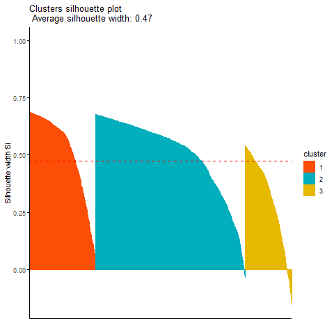

# RFM K-means Clustering Analysis

In this project, we focus on creating Recency, Frequency, Monetary (RFM) K-means clustering to identify different groups of customers. The dataset contains online retail transactions from 01/2010 to 09/2011. 

## Results

The table and bar plot below show the average of RFM by the each cluster. From the RFM K-means cluster analysis, the customers in cluster 3 are the most loyal customers since they frequently buy, spend the most and frequently buy. Customer from cluster 1, are those spend and purchase less. The online should focus on cluster 1 customer to learn more about the customer (Market segmentation) 

## Data
The dataset contains 541,909 observations with 8 variables. The dataset also contains about 25% missing values for the variable `CustomerID`. We remove those observations.   

Next RFM are calculated for each customer. Recency tells us how recent a customer has made a purchased, frequency is the number of transaction, and monetary is total amount of money a customer has spent. 

The table below shows the first 6 customers RFM. For example in the first row, `CustomerID` 12346 has a monetary of 0 dollars with a frequency 2. This means that this particular customer purchased an item and then decided to return it. 

Next we look at descriptive statistics of the RFM data. The boxplot below shows that the data is right skewed. 

 
Before performing clustering analysis data, we take two approaches: 

1. Log Transformation then scale data 
2. Remove extreme outliers then scale data

since the data is skewed. We compared the cluster and choose the better approach to handle the skewed data.

## Log Transformation

For the first approach, we transformed the data by taking the log transformation then normalizing the data.

Before performing K-means, we calculate the Hopkins statistic, which measures the cluster tendency of the dataset. The  Hopkins statistic is .98, really close to 1. Thus the data contains meaningful clusters.

To decide how many cluster to selected for the K-means method we look at the "Elbow method" and Silhouette plot to get an idea of the number of cluster to select. Based on the two plots we tried k = 3,4,5,6 for the number of cluster.

The K-means was performed with k = 3,4,5,6. The plots below show the cluster validation using Silhoutte Analysis for k = 3 and k = 4. The Silhoutte value close to 1 indicates the data is cluster well. Values close to zero are poor results.

In the Silhoutte plots above, the red dash line represents the average Silhoutte score. In all Silhoutte plots there at least one label that is below the average Silhoutte score meaning the "k" cluster is not a good choice.

## Remove extreme outliers

Instead of the log transformation, next we choose to remove the extreme outliers from the data then normalize the data. 

Before performing K-means, we calculate the Hopkins statistic, which measures the cluster tendency of the dataset. The  Hopkins statistic is .90, really close to 1. Thus, the data contains meaningful clusters.

Similarly we plot the "Elbow method" and Silhoutte plot to pick a range of candidate for K-means clustering. Based on the two plots we tried k = 3 and 4 for the number of cluster.

In the Silhoutte plots below, the red dash line represents the average Silhoutte score. In all Silhoutte plots, the cluster Silhoutte score are greater than the average Silhoutte score. Between the plots,  k = 3 Silhoutte score has less negative values. Negative values may indicating it may be in the wrong cluster.  

## RFM Analysis

Below is the cluster plot of the K-means for k = 3.

## Results

The table and bar plot below show the average of RFM by the each cluster. From the RFM analysis, the customers in cluster 3 are the most loyal customers since they frequently buy, spend the most and frequently buy. Customer from cluster 1, are those spend and purchase less. The online should focus on cluster 1 customer to learn more about the customer (Market segmentation) 

